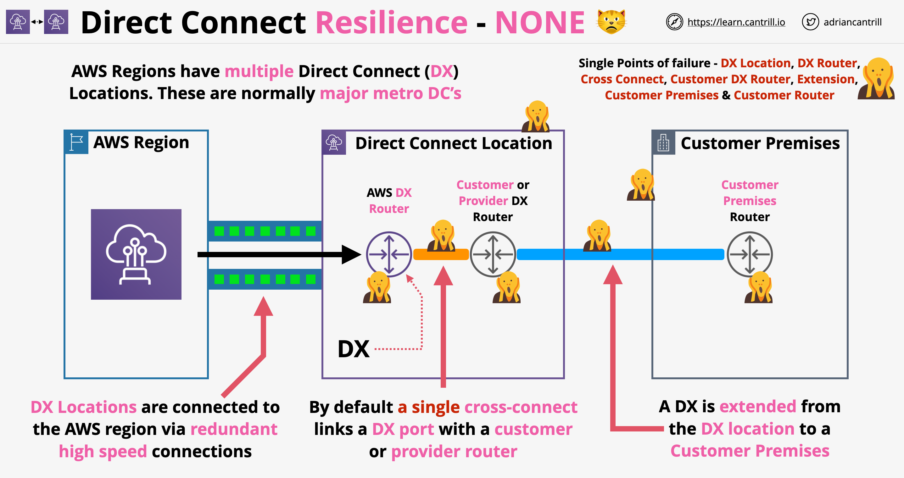
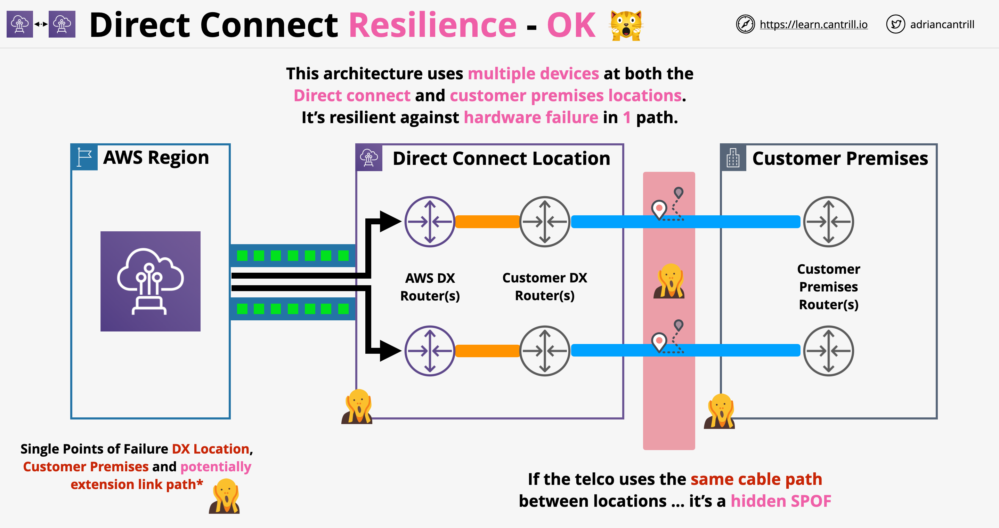
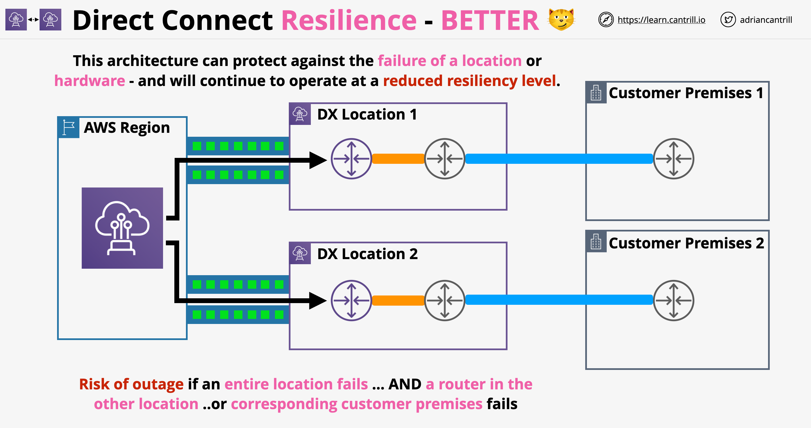
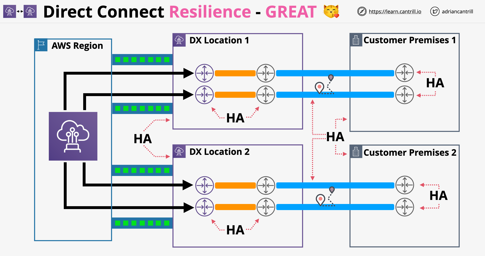
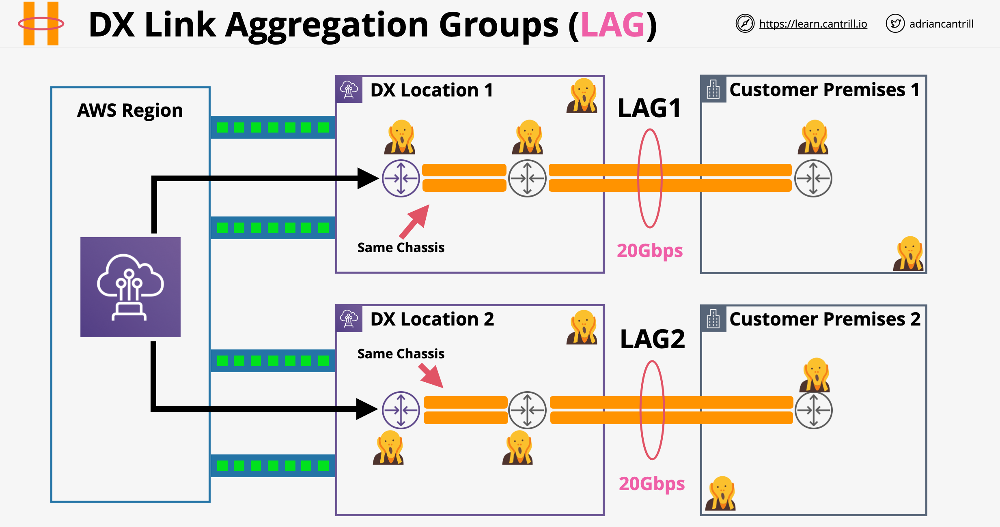
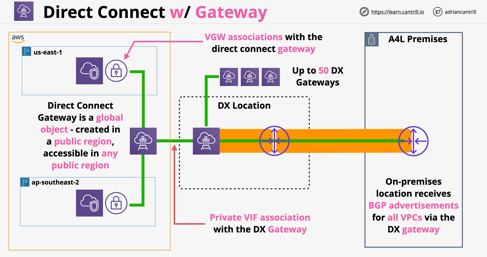
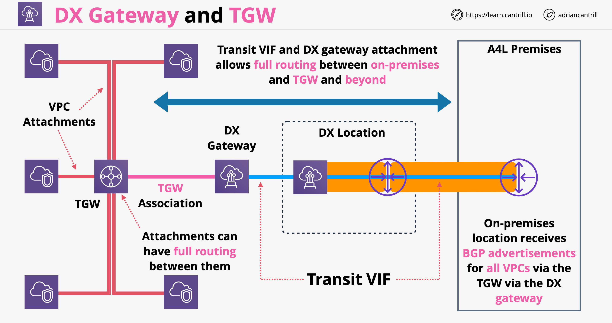

# DX - Direct Connect

- It is a physical entry point into the AWS network
- It is a physical fibre connection through which we can access AWS services without sending traffic through the public internet
- In order to get a Direct Connect we have to create a connection (logical entity) inside an AWS account. This connection will have an unique ID
- We we create the connection, we have to specify a few details, the most important being:
    - The connection speed required (1 Gbps or 10 Gbps)
    - DX location
- AWS will allocate a DX port in the selected DX location, which is a fibre port on AWS DX router. Depending on the speed we will interface with it using **1000-Base-LX** or **10GBASE-LR** standards
- We will have to install a cross-connect in our network

- Virtual Interface (VIF): VLAN (which provides isolation) and BGP session, grant access to AWS services
- Direct Connect ordered directly from AWS can have up to 50 VIFs per DX (+transit VIFs)
- Direct Connect ordered from AWS partner can have restrictions for the number of VIFs
- 3 types of VIFs can be run over DX:
    - Private VIF (VPC)
    - Public VIF (Public Zone Service)
    - Transit VIF
- Private VIF:
    - Provides private network connectivity, connects on-prem networks with VPCs
    - By default a private VIF can only connect to VPC in the same region where the connection is
- Public VIF:
    - Grants access to public AWS services such as S3, DynamoDB, SNS, SQS, etc.
    - Public VIF can not be used to access the public internet
- Hosted VIFs: we can share VIFs with other AWS accounts. Can be connected to a virtual private gateway in a VPC of the other account

## Direct Connect Types

- There are a few ways to get a DX:
    - Get the connection directly from AWS
        - Offers to speed options 1Gbps and 10Gbps
        - We get a port at a DX location, from which we have to arrange to connection to our location
        - We can run 50 VIFs + 1 transit VIF
    - Get the connection via partner
        - Offers wider range of speeds from 50Mbps up to 10Gbps
        - Hosted Connection: DX connection hosted an managed by the partner with **one VIF**
        - Hosted VIF individually: less ideal than a hosted connection, no dedicated bandwidth allocated

## Direct Connect - Other Notes

- Direct Connect offers no encryption!
- To overcome this: create a public VIF and establish a Site-to-Site VPN over it
- With direct connect we do not share any data cap with internet providers
- No transit over the internet, which means low and consistent latency
- DX offers cheaper data transfers and faster speeds compared to other methods
- VPC endpoints can not be accessed through Private VIFs!

## Direct Connect Resilience and HA

- Improve resilience:
    - Order 2 DX ports instead of one => 2 cross connects, 2 customer DX routes connecting to 2 on-premises routes
    - Connect to 2 DX locations, have to customer routers and 2 on-premises routers in different buildings (geographically separated)
- Not resilient DX architecture:

- Resilient DX architecture:

- Improved resilient DX architecture:

- Extreme resilient DX architecture:

## Direct Connect Link Aggregation Groups (LAG)

- LAG: allows to take multiple physical connections and configure them to act as one
- From speed perspective: the speed is increases linearly depending on the number of connections
- LAG do provide resilience, although AWS does not market them as such. They do not provide any resilience regarding hardware failure or the failure of entire location
- LAGs use an Active/Active architecture, maximum 4 connection can be part of the LAG
- All connections must have the same speed and terminate at the same DX location
- `MinimumLinks`: the LAG is active as long as the number of working connections is greater or equal to this value

## Direct Connect Gateway and Transit VIFs

- Direct Connect is a regional service
- It is a link from a customer premises to one or more DX locations
- Public VIFs can be used to access public services in all public AWS regions
- Private VIFs can only connect to VPCs in the same region by default via VGWs
- Direct Connect Gateway:
    - It is a global network device accessible in all regions
    - Direct Connect integrates with a Direct Connect Gateway using a private VIF. This VIF is associated with the Direct Connect Gateway (not with the VGWs from the VPC)
    - On the AWS side we create VGW associations in any VPC in any regions. This connects those VPCs to the DX gateway and onwards using the private VIF into on-premises network
    - Direct Connect Gateway does not allow VPCs to communicate with each other, it allows only on-prem network to communicate with AWS VPCs
- We can have 10 VGW attachments per DX Gateway

- Integrate DX Gateways with Transit Gateways:
    - Transit Gateways can be integrated with DX Gateways using a transit VIF
    - We can have 1 transit VIF per DX connections
    - Transit VIF is associated with DX gateway and allows associations between the DX gateways and 3 transit gateways
    - Transit gateways can be peered
