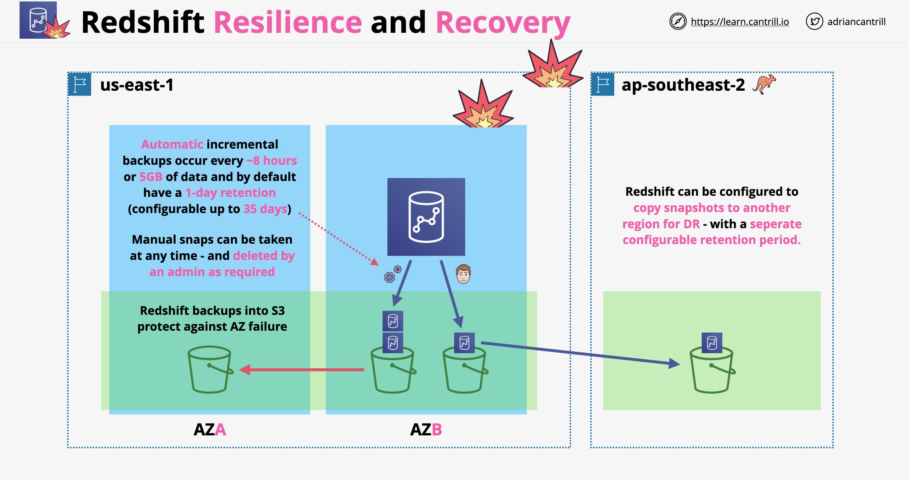

# Amazon Redshift

- It is petabyte scale data warehouse
- It is designed for reporting and analytics
- It is an OLAP (column based) database, not OLTP (row/transaction)
    - OLTP (Online Transaction Processing): capture, stores, processes data from transactions in real-time
    - OLAP (Online Analytical Processing): designed for complex queries to analyze aggregated historical data from other OALP systems
- Advanced features of Redshift:
    - RedShift Spectrum: allows querying data from S3 without loading it into Redshift platform
    - Federated Query: directly query data stored in remote data sources
- Redshift integrates with Quicksight for visualization
- It provides a SQL-like interface with JDBC/ODBC connections
- Redshift is a provisioned product, it is not serverless. It does come with provisioning time
- It uses a cluster architecture. A cluster is a private network, and it can not be accessed directly
- Redshift runs in one AZ, not HA by design
- All clusters have a leader node with which we can interact in order to do querying, planning and aggregation
- Compute nodes: perform queries on data. A compute node is partition into slices. Each slice is allocation a portion of memory and disk space, where it processes a portion of workload. Slices work in parallel, a node can have 2, 4, 16 or 32 slices, depending the resource capacity
- Redshift if s VPC service, it uses VPC security: IAM permissions, KMS encryption at rest, CloudWatch monitoring
- Redshift Enhance VPC Routing:
    - Can be enabled
    - Traffic is routed based on the VPC networking configuration
    - Traffic can be controlled by security groups, it can use network DNS, it can use VPC gateways
- Redshift architecture:
    

## Redshift Resilience and Recovery

- Redshift can use S3 for backups in the form a snapshots
- There are 2 types of backups:
    - Automated backups: occur every 8 hours or after every 5 GB of data, by default having 1 day retention (max 35). Snapshots are incremental
    - Manual snapshots: performed after manual triggering, no retention period
- Restoring from snapshots creates a brand new cluster, we can chose a working AZ to be provisioned into
- We can copy snapshots to another region where a new cluster can be provisioned
- Copied snapshots also can have retention periods

## Amazon Redshift Workload Management (WLM) 

- Enables users to flexibly manage priorities within workloads so that short, fast-running queries won’t get stuck in queues behind long-running queries
- Amazon Redshift WLM creates query queues at runtime according to service classes, which define the configuration parameters for various types of queues, including internal system queues and user-accessible queues
- From a user perspective, a user-accessible service class and a queue are functionally equivalent
