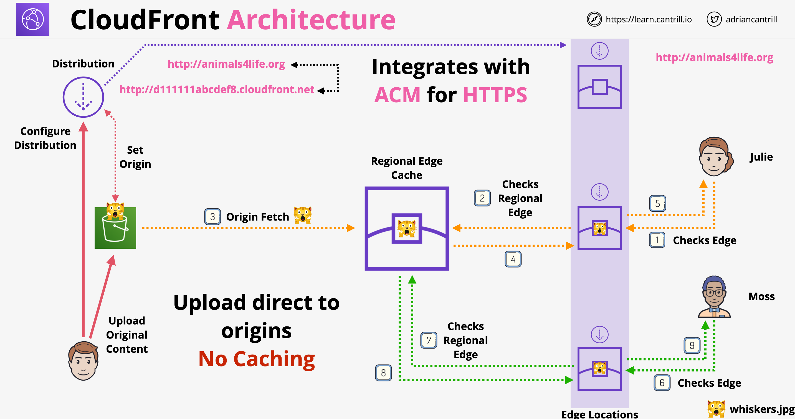
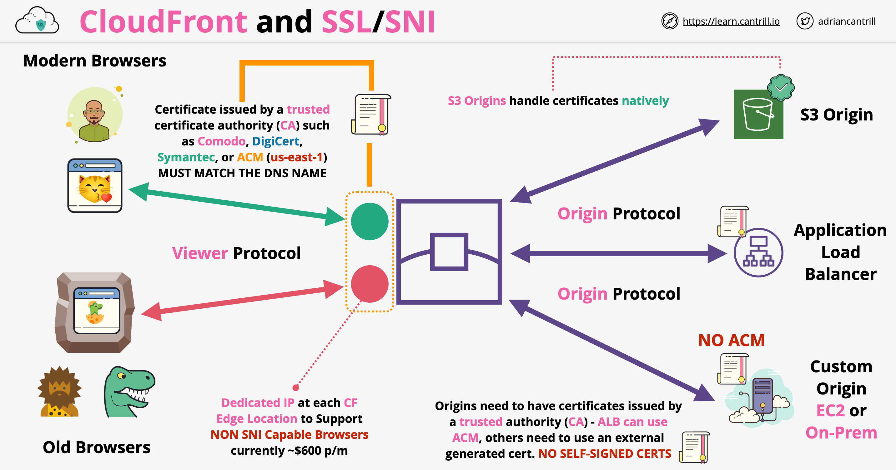

# CloudFront

- It is a content deliver network (CDN)
- Its job is to improve the delivery of content from its original location to the viewers of the content
- It is accomplishing this by caching and by using an efficient global network

## CloudFront Terms and Architecture

- **Origin**: the source location of the content, can be S3 or custom origin (publicly routable IPv4 address)
- **Distribution**: unit of configuration within CloudFront, which gets deployed out to the CloudFront network. Almost everything is configured within the distribution
- **Edge Location**: pieces of global infrastructure where the content is cached. They are smaller than AWS regions, but there are way more in number. Can be used to distribute static data only
- **Regional Edge Cache**: larger version of an edge location. Provides another layer of caching
- CloudFront Architecture:
    
- If we are using S3 origins, the region edge location is not used if there is a cache miss for an edge location. Only custom origin can use the regional edge cache!
- **Origin fetch**: the content is fetched from the origin in case of a cache miss on the edge location
- **Behavior**: it is configuration within a distribution. Origins are directly linked to behaviors, behaviors are linked to distributions
    

## CloudFront Behaviors

- Distributions are units of configuration in CF, lots of high level options are configured on the distribution level:
    - Price class
    - Web Application Firewall attachment
    - Alternate domain names
    - Type of SSL certificate
    - SNI configuration
    - Security policy
    - Supported HTTP versions
    - etc.
- A single distribution can have one (default behavior) or multiple behaviors
- Any incoming request is pattern matched against behavior's pattern
- Once a request is pattern matched against a behavior, it will become subject ot the behavior's configurations which can be the following:
    - Origin or origin group
    - Viewer protocol policy (redirect HTTP to HTTPS)
    - Allowed HTTP methods
    - Field level encryption
    - Cache directives
    - TTL (min, max, default)
    - Restrict viewer access to a behavior (Trusted Signers)
    - Compress objects automatically
    - Associate Lambda@Edge function

## TTL and Invalidations

- And edge location views an object as not expired when it is within its TTL period
- More frequent cache hits = lower origin load
- Default validity period of an object (TTL) is 24 hours. This is defined in the behavior
- Minimum TTL, maximum TTL: set lower or upper values which an individual object can have
- Object specific TTL values can be set by the origins using different headers:
    - Cache-Control `max-age` (seconds): TTL value in seconds for an object
    - Cache-Control `s-maxage` (seconds): same as `max-age`
    - Expires (Date and Time): expiration date and time
- For all of these headers if they specify a value outside of minimum, maximum range, the min/max value will be used
- Custom headers for S3 origins can be configured in object's metadata
- Cache invalidations are performed in a distribution and it applies to all edge locations (it takes time)
- Cache invalidation invalidates every object regardless of the TTL value, based on the invalidation pattern
- There is a cost allocated when invalidation is applied
- Instead of invalidation we may consider **versioned file names**
- Versioned file names also help to:
    - Avoid using local browser cache in case of a newer file
    - Help improve logging
    - Reduce cost, no need for manual invalidation
- S3 object versioning and versioned file names should not be confused!

## CloudFront and SSL

- Each CF distribution receives a default domain name (CNAME)
- HTTPS can be enabled by default for this address
- CF allows alternate domain names (CNAME)
- In case of HTTPS we have to add our own matching certificate to CF. 
- In case of HTTP, CF should be able to verify that we own the DNS, which is accomplished by also adding an SSL certificate
- SSL certificates are imported using ACM (AWS Certificate Manager). ACM is a regional service, because of this the certificate for global services (such as CF) needs to be imported in *us-east-1* region
- Handling HTTP and HTTPS:
    - We can allow both HTTP and HTTPS on a distribution
    - We can redirect HTTP to HTTPS
    - We can restrict to only allow HTTPS (any HTTP will fail)
- There are two sets of connections when using CF:
    - Viewer => CF (viewer protocol)
    - CF => Origin (origin protocol)
- Both connections need valid public certificates (self-signed certificates will not work)

## CloudFront and SNI

- Historically every SSL enabled site needed its own IP
- Encryption for HTTP/HTTPS happens on the TCP connection level
- Host header happens after that at Layer 7. Allows to specify to which application we want to connect in case multiple applications run on the same server
- TLS encryption happens before deciding which application to access
- 2003 extension was added to TLS: SNI - allowing to specify which host to be used
- Older browser do not necessary support SNI. CF needs to allocate dedicated IP addresses for these users, charging extra from us
- CF can be used in SNI mode (free) or allocating extra IP addresses ($600 per month)
- CloudFront SSL/SNI architecture:
    
- For S3 origin, we don't need to apply certificates for the origin protocol. For ALB/EC2/on-prem we can have to apply public certificates which needs to match the DNS name of the origin