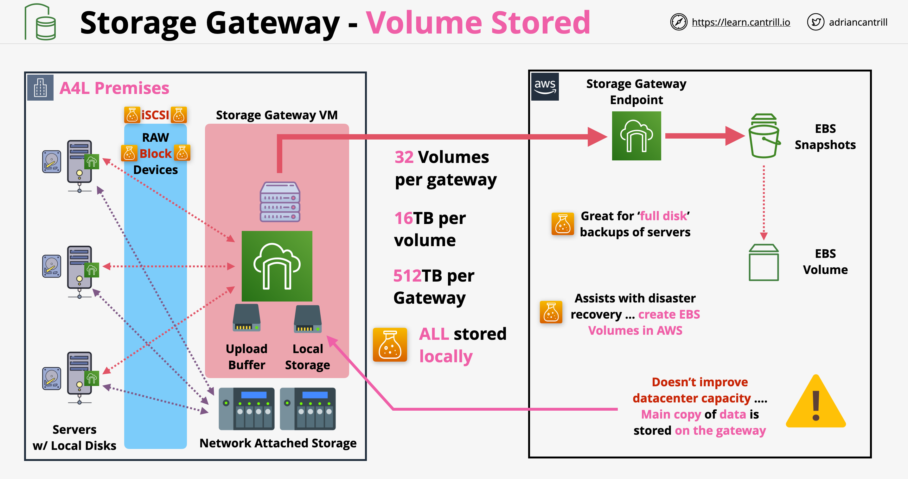
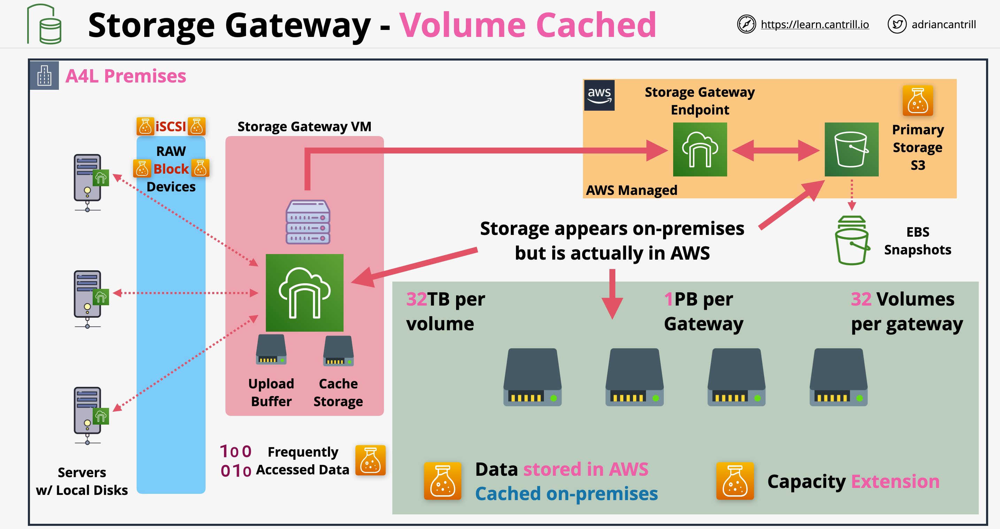

# Storage Gateway

- Normally runs as a VM on-premises (or hardware appliance)
- Acts as bridge between storage that exists on-premises and AWS
- Presents storage using iSCSI, NFS or SMB
- On AWS integrates with EBS, S3 and Glacier
- Storage gateways is used for migrations, extensions, storage tiering, DR and replacement of backup systems

## Volume Gateway

- Offers 2 different types of operation:
    - Stored Mode:
        - The VM appliance presents volumes over iSCI to servers
        - Servers can create files system on and use it in a normal way
        - This volumes consume capacity on-premises
        - Storage gateway has local storage, used as primary storage, everything is stored locally
        - Upload buffer: any data written to the local storage is also copied in the upload buffer and it will be uploaded to the cloud asynchronously via the storage gateway endpoint
        - The upload data is copied into S3 as EBS snapshots which can be converted into EBS volumes
        - It is great to do full disk backups, offering excellent RTO and RPO values
        - Stored Mode does not allow extending the data center capacity! The full copy of the data is stored locally
        
    - Cached Mode:
        - Cached Mode shares the same basic architecture with Stored Mode
        - The main location of data is no longer on-premises, it is on AWS S3
        - It has a local cache for the data only storing the frequently accessed data, the primary data will be in S3
        - The data will be stored in AWS managed area of S3, meaning it wont be visible using the AWS console. It can be viewed from the storage gateway console
        - The data is stored in raw block state
        - We can create EBS volumes out of the data
        - Cached Mode allows for an architecture know as datacenter extension
        
