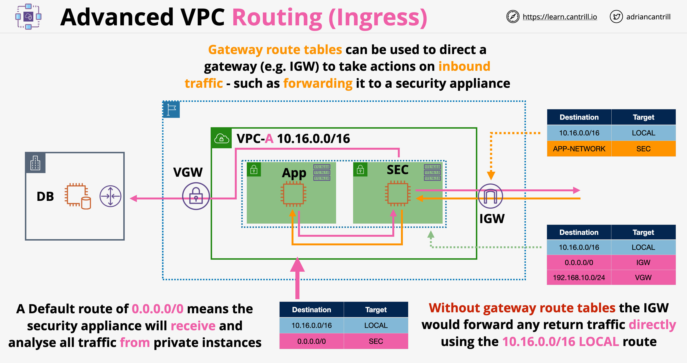
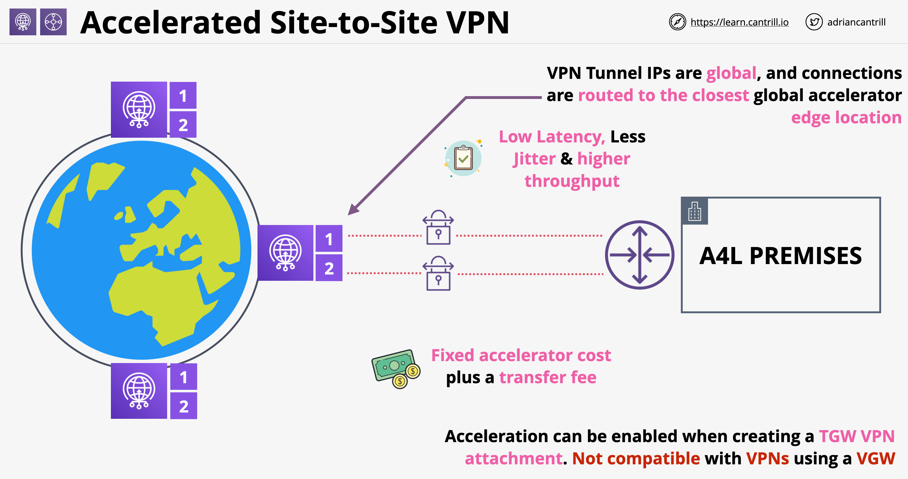

# VPC - Virtual Private Cloud

## Public vs Private Services

- Public service: a service which is accessed by using public endpoints
- Private service: a service which runs inside a VPC
- Either private or public, every service can have permissions in order to be accessible
- VPC: private network isolated from the internet. Can't communicate to the network unless we are allowing it. Nothing from the internet can reach the services from a VPC as long as we do not configure it otherwise
- Internet Gateway: we can connect it to a VPC, this will allow the services in the VPC to communicate with the public internet

## DHCP in a VPC

- DHCP - Dynamic Host Configuration Protocol: offers auto configuration for network resources
- Every device has a hard-coded MAC address (Layer 2 address)
- DHCP begins with a L2 broadcast to discover a DHCP server on the local network
- Once discovered a DHCP server and a DHCP clients communicate, meaning that the client will get in the end an IP address, a Subnet Mask and Default Gateway address (L3 configuration)
- DHCP also configures which DNS server should a resource use in a VPC
- Also configures NTP servers, NetBios Name Servers and Node types
- For DNS server we can explicitly provide values or we can use `AmazonProvidedDNS`
- We also get allocated 1 or 2 DNS names for the services in the VPC. One can be public if the instance has a public IP address allocated
- Custom DNS names: we can give custom DNS names to EC2 instances if we use our own custom DNS servers
- DHCP options sets:
    - Once created option sets can not be changed
    - Can be associated with 0 or more VPCs
    - Each VPC can have a max of 1 option set associated
    - We we change a DHCP option set associated to the VPC, the change is immediate, but any new setting will only affect anything once a DHC renew occurs
    - What we can configure in an option set:
        - DNS server (Route 53 resolver) what we can use in the VPC
        - NTP server

## VPC Router Deep Dive

- Is at the core of any network which involves AWS
- Is a virtual router in a VPC
- It is HA across al AZs in a region, no management overhead is required
- It is scalable, no management overhead required
- VPC routes routes traffic between subnets in a VPC
- Routes traffic from external network into the and vice-versa
- VPC router has an interface in every subnet in a VPC: `subnet+1` address (Default Gateway), the first IP address in each subnet after the network address itself
- We control how the VPC routes traffic using Route Tables

## VPC Route Tables

- Every VPC is created with a main Route Table (RT), which is the default for every VPC
- Custom route tables can be created for each subnet
- Subnets can be associated with only one RT which can be the main one or custom
- If we disassociate a custom RT form a subnet, the main RT will be attached to it
- Main RT should not be changed, custom RT should be used for any routing changes
- RT have routes, routes have an order, the most specific route wins
- Edge Association: a RT tables is associated with network gateway
- All RTs have at least one route: the local route which matches the VPC cidr range. These routes are un-editable

## NACL - Network Access Control Lists

- A NACL can be considered to be a traditional firewall in an AWS VPC
- NACLs are associated with subnets, every subnet has a NACL associated to it
- Connection inside a subnet are not affected by NACLs
- NACls can be considered stateless firewalls, so we can talk about the following type of rules:
    - Inbound rules: affect data coming into the subnet
    - Outbound rules: affects data leaving from the subnet
- Rules can explicitly **ALLOW** and explicitly **DENY** traffic
- Rules are processed in order:
    1. A NACL determines if a the inbound or outbound rules apply
    2. It starts from the lower rule number, evaluates traffic against each rule until is a match (based on IP range, port, protocol)
    3. Traffic is allowed/denied based on the rule
- Last rule is an implicit deny in every NACL, if no rule before that applies, traffic will be denied
- Default NACL: when a VPC is created, a default NACL is attached to it. The default NACL is allowing all traffic
- Custom NACL: we can create them and attach them to subnets. The default NACL denies by default all traffic. Can be associated with many different subnet, however each subnet can have only one NACL associated to it at any time
- NACL are not aware af any logical resources within a VPC, they are aware of IPs, CIDRs and protocols

## SG - Security Groups

- Security Groups are stateful firewalls, meaning they detect response traffic to a request and they automatically allow traffic
- SGs do not have explicit **DENY** rules, they can be used to block bad actors (use NACLs for this)
- SGs support IP/CIDR rules and also allow to reference logical resources
- SGs are attached to Elastic Network Interfaces (ENI), when we attach a SG to an EC2, the SG will be attached to the primary ENI
- SGs are capable to reference logical resources, ex. other security groups or self referencing

## AWS Site-to-Site VPN

- Site-to-Site VPN: it is a logical connections between a VPC and an on-premise network running over the public internet. The connection is encrypted using IPSec
- Can be fully HA if it is implemented correctly
- It is quick to provision, it can be provisioned in less than an hour (contrast to DX)
- Virtual Private Gateway (VGW): it is a gateway object which can be the target of one or more rules in a Route Tables. It can be associated to a single VPC
- Customer Gateway (CGW): can refer to 2 different things:
    - Ofter is referred to the logical configuration in AWS
    - Physical on-premises router which the VPN connects to
- VPN Connection: the connection linking the VGW from the AWS to the CGW
- Static vs Dynamic VPN:
    - Dynamic VPN uses BGP protocol, if customer router does not support BGP, we can not use dynamic VPNs
    - Static VPN uses static network configuration: static routes are added to the route tables AWS side, static networks has to be identified on the VPN connection on-premise side. It is simple, it just uses IPSec, works anywhere, having limitation on terms of HA
    - Dynamic VPN uses BGP. Allows routing on the fly, allows multiple links to be used at once between the same locations. Allows using HA available architectures.
        - Route propagation: if enabled means that routes are added ro the Route Table automatically
- Speed Limitation for VPN: 1.25 Gbps, AWS limitation
- Latency considerations: inconsistent, traffic goes through the public internet
- Cost: hourly cost for outgoing traffic
- VPN can be used for Direct Connect backup or they can be used over the Direct Connect for adding a layer of encryption

## AWS Transit Gateway

- It is a network transit hub which connects VPCs to each other and to on-premise networks using Site-to-Site VPNs and Direct Connects
- It is designed to reduce the network architecture complexity in AWS
- It is a network gateway object, it is HA and scalable
- Attachments: we create attachments in order for the TGW to connect to VPCs and on-premise networks. Valid attachments are:
    - VPC attachments
    - Site-to-Site VPN attachments
    - Direct Connect Gateway attachments
- Attachments are configured in each subnet of the connected VPCs
- We can also peer transit gateways across cross regions and/or cross accounts
- We can also attach transit gateways to the DX connections
- Transit Gateway Considerations:
    - Supports transitive routing: single transit gateway with multiple attachments using route tables
    - Can be used to create global networks with peering
    - We can share transit gateways using AWS RAM
    - Transit Gateways offer less complex architectures compared to VPC peering solutions

## Advanced VPC Routing

- **Subnets are associated with 1 route table (RT) only, no more noe less!**
- This route tables is either the main route table from the VPC or a custom route table
- In case of a custom route table association with a subnet, the main route table is disassociated. In case the custom RT is removed, the main RT is associated again with the subnet
- RT can associated with an internet gateway (IGW) or virtual private gateway (VGW)
- IPv4/6 are handled separately within a RT
- Routes send traffic based on a destination to a target
- Route tables have a maximum of 50 static routes and 100 dynamic routes
- When a traffic arrives to an interface (IGW, VGW), it is matched to the relevant route table
- All routes from a route table are evaluated - highest-priority matching is used
- Route tables can contain 2 types of routes:
    - Static routes: added manually by us
    - Propagated routes: added when enabled by us on the VPC or on any individual RT
- Evaluation rule for the routes: 
    1. Longest prefix wins, example /32 wins over /24, /16 or /0. More specific routes always win!
    2. Static routes take priority over propagated routes
    3. For any routes learned by propagation:
        1. DX
        2. VPN Static
        3. VPN BGP
        4. AS_PATH (distance within two logical systems)

## Ingress Routing

- All outgoing traffic is routed to a security appliances
- The security appliance is sitting in the public subnet which has a RT assigned to it. This RT sends all unmatched traffic out through the IGW and anything for the corporate network through the VGW
- Ingress routing allows to assign route tables to gateways (Gateway route tables). **Gateway route tables** can be attached to internet gateways or virtual gateways and can be used to take action on inbound traffic (route to a security instance for assessment)

## Accelerated Site-to-Site VPN

- Performance enhancement for AWS Site-to-Site VPN that uses the AWS global network, the same network used for Global Accelerator and CloudFront
- Using a classic Site-to-Site VPN, the traffic goes through the public internet. In order to avoid this, some companies use a Site-to-Site VPN over Direct Connect. Direct Connect offers more better performance, but at a higher cost. Since DX is not an option for everybody, accelerated Site-to-Site VPN was created to improve performance compared to classic Site-to-Site VPNs
- Accelerated Site-to-Site VPN architecture:

- Acceleration can be enabled when creating a Transit Gateway attachment only! Not compatible with VPNs using virtual gateways (VGW)
- Accelerated Site-to-Site VPN has a fixed accelerator cost fee and a transfer fee

