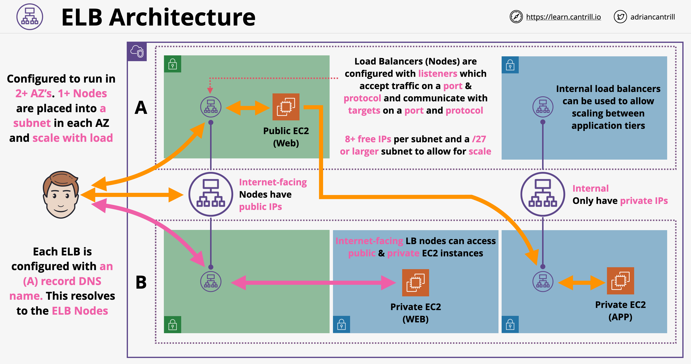

# ELB - Elastic Load Balancer

## ELB Architecture

- It is the job of the load balancer to accept connection from an user base and distribute it to the underlying services
- ELB support many different type of compute service
- LB architecture:

- Initial configurations for ELB:
    - IPv4 or double stacking
    - We have to pick the AZ which the LB will use, specifically we are picking one subnet in 2 or more AZs
    - When we pick a subnet, AWS places one or more load balancer nodes in that subnet
    - When an LB is created it has a DNS A record. The DNS name resolves all the nodes located in multiple AZs. The nodes are HA: if the node fails, a different one is created. If the load is to high, multiple nodes are created
    - We have to decide on creation if the LB is internal or internet facing (have public IP addresses or not)
- Listener configuration: what the LB is listening to (what protocols, ports etc.)
- An internat facing load balancer can connect to both public and private instances
- Minimum subnet size for a LB is /28 - 8+ fee addresses per subnet (AWS suggests a minimum of /27)

## Cross-Zone Load Balancing

- Initially each LB node could distribute traffic to instances in the same AZ
- Cross-Zone Load Balancing: allows any LB node to distribute connections equally across all registered instances in all AZs

## User Session State

- Session state: 
    - A piece of server side information specific to one single user of one application
    - It does persist while the user interacts with the application
    - Examples of session state: shopping cart, workflow position, login state
- The date representing a sessions state is either stored internally or externally (stateless applications)
- Externally hosted session:
    - Session data is hosted outside of the back-end instances => application becomes stateless
    - Offers the possibility to do load balancing for the back-end instances, the session wont get lost in case the LB redirects the user to a different instance