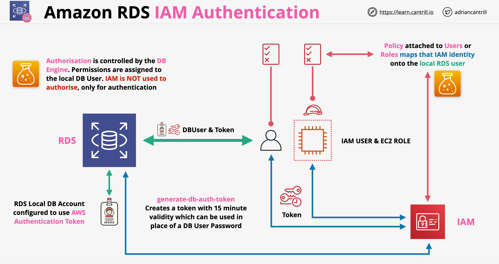

# RDS - Relational Database Service

- RDS is often described as a Database-as-a-service (DBaaS)
- RDS provides managed database instances, which can themselves hold one or more databases
- Benefits of RDS are the we don't need to manage the physical hardware, the server operating system or the database system itself
- RDS supports MySQL, MariaDB, PostgreSQL, Oracle, Microsoft SQL Server
- Amazon Aurora: it is a db engine created by AWS and we can select it as well for usage

## RDS Database Instance

- Runs one of the few types of db engine mentioned above
- Can contain multiple user created databases
- A database instance after creation can be accessed using its hostname (CNAME)
- RDS instances come in various types, share many of features of EC2. Example of instances: db.m5, db.r5, db.t3
- RDS instances can be single AZ or multi AZ (active-passive failover)
- When an instance is provisioned, it will have a dedicated storage allocated as well (usually EBS)
- Storage allocated can be based on SSD storage (IO1, GP2) or magnetic (mainly for compatibility)
- Billing for RDS:
    - We are billed based on instance size on a hourly rate
    - We are also billed per storage (GB/month) + extra per iops in case of provisioned iops (IO1)

## RDS Multi AZ

- Used to add resilience to an RDS instance
- Multi AZ is an option which can be enabled on an RDS instance, when enabled secondary hardware is allocated in another AZ (standby replica)
- RDS enables synchronous replication between primary and standby instances
- RDS is accessed via provided endpoint address (CNAME)
- With a single instance the endpoint address points the instance itself, with multi AZ, by default the endpoint points to the primary instance
- We can not directly access the standby instance
- If an error occurs with the primary instance, RDS automatically changes the endpoint to point to the standby replica. This failover occurs in around 60-120 seconds
- Multi AZ is not available in the Free-tier (generally costs double as it would the single AZ)
- Backups are taken from the standby instance (removes performance impact)
- Failovers can happen if:
    - AZ outage
    - Primary instance failure
    - Manual failover
    - Instance type change
    - Software patching

## RDS Backups and Restores

- RPO (Recovery Point Objective): time between the last working backup and the failure. Lower the RPO value, usually the more expensive the solution
- RTO (Recovery Time Objective): time between the failure and system being dully recovered. Can be reduced with spare hardware, predefined processes, etc. Lower the RTO value, the system is usually more expensive
- RDS backup types:
    - Manual snapshots:
        - Have to be run manually
        - First snapshot is full content of the DB, incremental onward
        - When any snapshot occures, there is brief interruption in the flowing of data
        - Manual snapshots do not expire
        - When we delete an RDS instance, AWS offers to make one final snapshot
    - Automatic backups:
        - Snapshots which occure automatically, first being full snapshot, incremental afterwards
        - Every 5 minute transaction logs are written to S3
        - Automatic backups are not retained, we can set the retention period between 0 and 35 days
        - Automatic backups can be retained after a DB is deleted, by they still expire after the retention period
- Backups are stored in AWS manages S3 buckets
- When we create a restore, RDS creates a new instance

## RDS Read-Replicas

- Provide 2 main benefits: performance and availability
- Read replicas are read-only replicas of an RDS instance
- Read replicas can be used for reading only data
- The primary instance and read replica is kept sync using asynchronous replication
- There can be a small amount of lag in case of replication
- Read replicas can be created in a different AZ or different region (CRR - Cross-Region Replication)
- We can 5 direct read-replicas per DB instance
- Each read-replica provides an additional instance of read performance
- Read-replicas can also have read-replicas, but lag starts to be a problem in this case
- Read-replicas can provide global performance improvements
- Snapshots and backups improve RPO but not RTO. Read-replicas offer near 0 RPO
- Read-replicas can be promoted to primary in case of a failure. This offers low RTO as well (lags of minutes)
- Read-replicas can replicate data corruption

## Data Security

- With all the RDS engines we can use encryption in transit (SSL/TLS). THis can be set to be mandatory
- For encryption at rest RDS supports EBS volume encryption using KMS which is handled by the host EBS and it is invisible for the database engine
- We can use customer managed or AWS generated CMK data keys for encryption at rest
- Storage, logs and snapshots will be encrypted with the same customer master key
- Encryption can not be removed after it is activated
- In addition to encryption at rest MSSQL and Oracle support TDE (Transparent Data Encryption) - encryption at the database engine level
- Oracle supports TDE with CloudHSM, offering much stronger encryption
- IAM authentication with RDS:
    - Normally login is controlled with local database users (username/password)
    - We can configure RDS to allow IAM authentication (only authentication, not authorization, authorization is handled internally!):
    
